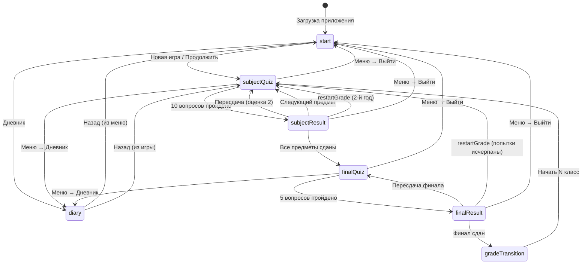

# Документация проекта «Школьник»

Мобильная веб-игра-викторина на **React 19 + Vite 8** в школьной атмосфере. Игрок проходит классы (1–11), сдаёт предметы по 10 вопросов, финальный тест и переходит в следующий класс.

---

## Содержание

1. [Структура файлов](#структура-файлов)
2. [Архитектура](#архитектура)
3. [Экраны](#экраны)
4. [Механика игры](#механика-игры)
5. [Система классов](#система-классов)
6. [Система предметов](#система-предметов)
7. [Система вопросов](#система-вариантов)
8. [Система оценок](#система-оценок)
9. [Система сохранений](#система-сохранений)
10. [Система достижений](#система-достижений)
11. [Переходы между экранами](#переходы-между-экранами)

---

## Структура файлов

```
school-game/
├── index.html                 # Точка входа HTML (lang=ru, viewport для мобильных)
├── package.json               # Зависимости: react, react-dom; dev: vite, eslint
├── vite.config.js             # Конфигурация Vite + @vitejs/plugin-react
├── eslint.config.js           # ESLint flat config
├── README.md                  # Краткое описание и команды запуска
├── public/
│   ├── favicon.svg
│   └── icons.svg
├── dist/                      # Сборка production (vite build)
└── src/
    ├── main.jsx               # ReactDOM.createRoot, StrictMode
    ├── App.jsx                # Главный компонент: состояние игры, логика, роутинг экранов
    ├── index.css              # Все стили приложения (≈890 строк)
    ├── components/
    │   ├── StartScreen.jsx           # Главное меню
    │   ├── GameScreen.jsx            # Экран викторины (предмет / финал)
    │   ├── ResultScreen.jsx          # Результат предмета
    │   ├── FinalScreen.jsx           # Результат финального теста
    │   ├── DiaryScreen.jsx           # Школьный дневник
    │   ├── GradeTransitionScreen.jsx # Переход между классами
    │   ├── InGameMenu.jsx            # Пауза / меню во время игры
    │   ├── AchievementPopup.jsx      # Всплывающее окно достижения
    │   ├── ProgressBar.jsx           # Прогресс-бар года
    │   ├── StudentAvatar.jsx         # Аватар ученика (настроение)
    │   └── ClassroomBackground.jsx   # Фон класса
    ├── data/
    │   ├── questions.js              # Константы, оценки, реэкспорт grades
    │   ├── achievements.js           # Справочник достижений
    │   └── grades/
    │       ├── index.js              # Реестр классов, API доступа к контенту
    │       ├── grade1.js             # Контент 1 класса (полный)
    │       └── grade2.js             # Контент 2 класса (пока копия 1 класса)
    └── utils/
        ├── progress.js               # Расчёт прогресса года
        ├── achievementChecks.js      # Проверка условий достижений
        ├── teacherPhrases.js         # Фразы учителя при ответах
        └── sounds.js                 # Звуки через Web Audio API
```

### Роли ключевых модулей

| Модуль | Ответственность |
|--------|-----------------|
| `App.jsx` | Единый источник истины: `gameState`, `uiState`, таймеры, ответы, дневник, сохранение |
| `data/grades/` | Контент по классам (предметы, вопросы, финал) |
| `data/questions.js` | Игровые константы и формулы оценок |
| `components/*` | Презентационные экраны без бизнес-логики |
| `utils/*` | Вспомогательные чистые функции |

---

## Архитектура

### Общий подход

Приложение — **одностраничное SPA** без React Router. Навигация реализована через поле `gameState.screen` и константу `SCREENS` в `App.jsx`. Все экраны рендерятся условно в одном дереве компонентов.

### Состояние

Разделено на два слоя:

**`gameState`** — персистентное игровое состояние:
- текущий экран, класс, предмет, индексы вопросов;
- ошибки, таймеры, попытки;
- дневник, достижения, сложность, звук;
- служебные поля (`returnScreen`, `menuOpen`, `lastSubjectResult` и т.д.).

**`uiState`** — эфемерное UI-состояние (не сохраняется):
- анимации (тряска, вспышка);
- фраза учителя;
- очередь и активное достижение.

### Поток данных

```
localStorage ←→ App.jsx (gameState) → Screen Components
                      ↓
              utils/ (progress, achievements, sounds, phrases)
                      ↓
              data/ (questions, grades, achievements)
```

### Side effects в App.jsx

- **Загрузка** прогресса из `localStorage` при монтировании.
- **Автосохранение** при каждом изменении `gameState` (с фильтрацией через `pickPersistedState`).
- **Таймеры** предмета и финала — `useEffect` с `setTimeout` 1 сек.
- **Достижения** — `useEffect` на `lastSubjectResult` / `lastFinalResult` с дедупликацией через `useRef`.
- **Заголовок вкладки** — `document.title` по текущему классу.

### Защита от двойного ответа

`answeringRef` блокирует повторный вызов `answerSubjectQuestion` / `answerFinalQuestion` во время обработки ответа (750 мс задержка перед переходом).

### UI-стек

- Чистый CSS в `index.css` (без UI-библиотек).
- Максимальная ширина контейнера 500px — ориентация на мобильные.
- Звук — синтез через `AudioContext`, без аудиофайлов.

---

## Экраны

### 1. StartScreen (`screen: 'start'`)

**Компонент:** `StartScreen.jsx`

Главное меню при запуске и после выхода из игры.

| Элемент | Действие |
|---------|----------|
| Выбор сложности | `easy` / `normal` / `hard` — меняет таймер вопроса |
| Переключатель звука | Вкл/выкл звуковые эффекты |
| «Продолжить» | Возврат на `returnScreen` (disabled без прогресса) |
| «Новая игра» | Сброс с confirm, старт с 1 класса |
| «Дневник» | Открыть дневник с возвратом на start |

---

### 2. GameScreen — викторина по предмету (`screen: 'subjectQuiz'`)

**Компонент:** `GameScreen.jsx`

Игровой экран с классной доской, аватаром, блокнотом с вопросом и 4 вариантами ответа.

Отображает:
- класс, предмет, номер вопроса (N/10);
- счётчик ошибок и попытки (1/3);
- таймер обратного отсчёта;
- прогресс года (`ProgressBar`);
- фразу учителя и настроение аватара (`happy` / `sad` / `neutral`);
- кнопки звука и меню (☰).

---

### 3. ResultScreen — результат предмета (`screen: 'subjectResult'`)

**Компонент:** `ResultScreen.jsx`

Показывает оценку, ошибки, предмет.

**Варианты:**
- **Оценка > 2** — кнопка «Продолжить» → следующий предмет или финал.
- **Оценка 2, есть попытки** — «Пересдать».
- **Оценка 2, попытки исчерпаны** (`isRepeatingYear`) — экран «Ты остался на второй год» → перезапуск класса.

---

### 4. GameScreen — финальный тест (`screen: 'finalQuiz'`)

Тот же `GameScreen`, но:
- `subject = "Финальный тест"`;
- 5 вопросов вместо 10;
- счётчик ошибок — `finalMistakes`;
- таймер — `finalTimer`.

---

### 5. FinalScreen — результат финала (`screen: 'finalResult'`)

**Компонент:** `FinalScreen.jsx`

| Результат | Действия |
|-----------|----------|
| Сдан (`passed`, mark > 2) | «Продолжить» → переход в следующий класс |
| Не сдан, есть попытки | «Пересдать финальный тест» |
| Не сдан, попытки исчерпаны | «Начать класс заново» |

---

### 6. GradeTransitionScreen (`screen: 'gradeTransition'`)

**Компонент:** `GradeTransitionScreen.jsx`

Кинематографический экран «Лето прошло…» при переходе из класса N в N+1. Кнопка «Начать N класс» сбрасывает индексы и начинает новый год.

---

### 7. DiaryScreen (`screen: 'diary'`)

**Компонент:** `DiaryScreen.jsx`

Школьный дневник по завершённым годам:
- таблица предметов: оценка, ошибки, попытка;
- финальный тест: оценка, ошибки, попытка;
- средний балл за класс.

Доступен из главного меню и игрового меню.

---

### 8. Оверлеи (не отдельные screen)

| Компонент | Когда показывается |
|-----------|-------------------|
| `InGameMenu` | `menuOpen && isPlaying` — пауза во время quiz/result |
| `AchievementPopup` | При разблокировке достижения (очередь) |
| Settings overlay | `settingsOpen` (legacy, дублирует настройки звука) |

---

## Механика игры

### Цикл одного класса

1. Пройти **все предметы** по очереди (по 10 вопросов каждый).
2. Сдать **финальный тест** (5 вопросов).
3. При успехе — **переход** в следующий класс.

### Ответ на вопрос

1. Игрок выбирает вариант **или** истекает таймер (считается ошибкой, `optionIndex = -1`).
2. Показывается фраза учителя, звук, подсветка ответа.
3. Через **750 мс** — следующий вопрос или экран результата.
4. При правильном ответе таймер сбрасывается на значение сложности.

### Сложность (таймер на вопрос)

| Режим | Секунд |
|-------|--------|
| Легко (`easy`) | 45 |
| Нормально (`normal`) | 30 |
| Сложно (`hard`) | 15 |

Выбирается в главном меню до начала/продолжения игры.

### Попытки

| Контекст | Максимум | Счётчик |
|----------|----------|---------|
| Предмет | 3 (`MAX_ATTEMPTS`) | `attemptsByGradeSubject[grade][subject]` |
| Финальный тест | 3 (`FINAL_TEST_MAX_ATTEMPTS`) | `finalAttemptsByGrade[grade]` |

При оценке **2** за предмет — пересдача того же предмета с нуля (вопросы 1–10, ошибки сбрасываются).

### «Второй год» (повтор класса)

Условие: оценка **2** за предмет **и** это была **3-я попытка** (`attempt >= MAX_ATTEMPTS`).

Действие `restartGrade()`:
- сброс индексов, ошибок, попыток текущего класса;
- удаление записи дневника за этот класс;
- возврат к первому предмету.

Аналогично для финала: после 3 неудачных попыток — «Начать класс заново».

### Запись в дневник

- Предмет записывается **только при оценке > 2** (3, 4 или 5).
- Финальный тест записывается **всегда** после прохождения (включая неудачу).
- Средний балл = среднее оценок всех предметов + финала (если финал сдан).

### Прогресс года

Функция `getYearProgress()`:
- `totalSteps = кол-во предметов + 1` (финал);
- `completed` = число сданных предметов в дневнике;
- на экранах финала — `completed = subjects.length`;
- бонус +0.35 шага, если игрок на предмете впереди записанного прогресса;
- процент округляется до целого.

---

## Система классов

### Концепция

Игра задумана на **11 классов** (`MAX_GRADE = 11`), но контент зарегистрирован только для **1** и **2** классов.

### Реестр (`data/grades/index.js`)

```javascript
GRADE_REGISTRY = {
  1: grade1Config,
  2: grade2Config,
}
```

API:
- `getGradeConfig(grade)` — конфиг класса или `null`;
- `getGradeSubjects(grade)` — массив названий предметов;
- `getQuestionsForSubject(grade, subject)` — 10 вопросов;
- `getFinalTestQuestions(grade)` — 5 вопросов финала;
- `getAllRegisteredGrades()` — список зарегистрированных классов.

### Структура конфига класса

```javascript
{
  grade: number,
  subjects: string[],
  questionsBySubject: { [subject]: Question[] },
  finalQuestions: Question[],
}
```

### Текущее состояние контента

| Класс | Статус |
|-------|--------|
| 1 | Полный уникальный контент (30 вопросов + 5 финальных) |
| 2 | Заглушка: копирует контент 1 класса (`grade2.js`) |
| 3–11 | Не зарегистрированы — при переходе `getGradeSubjects` вернёт `[]` |

### Переход между классами

После успешного финала → `GradeTransitionScreen` → `currentGrade = nextGrade`, сброс прогресса года, инициализация попыток для нового класса.

`nextGrade = Math.min(currentGrade + 1, MAX_GRADE)` — теоретический потолок 11 класс.

### Добавление нового класса

1. Создать `src/data/grades/gradeN.js`.
2. Зарегистрировать в `GRADE_REGISTRY` в `index.js`.

---

## Система предметов

### Предметы по умолчанию (1 и 2 класс)

1. **Математика**
2. **Русский язык**
3. **Окружающий мир**

Константа `SUBJECTS` в `questions.js` дублирует этот список для обратной совместимости.

### Порядок прохождения

Предметы идут **строго по индексу** в массиве `subjects` текущего класса:
- `currentSubjectIndex: 0 → 1 → 2`;
- после последнего — финальный тест.

Нельзя пропустить предмет или выбрать порядок.

### Данные предмета в дневнике

```javascript
{
  subject: string,      // название
  mark: number,         // 3, 4 или 5
  mistakes: number,     // ошибок за попытку
  passedAttempt: number // номер успешной попытки
}
```

---

## Система вопросов

### Формат вопроса

```javascript
{
  question: string,           // текст вопроса
  options: string[4],           // 4 варианта ответа
  correctIndex: number,         // индекс правильного (0–3)
}
```

### Количество

| Тип | Константа | Значение |
|-----|-----------|----------|
| Вопросов на предмет | `QUESTIONS_PER_SUBJECT` | 10 |
| Вопросов финала | `FINAL_TEST_QUESTIONS` | 5 |

### Источник вопросов

- Предметные — `getQuestionsForSubject(grade, subject)`;
- Финальные — `getFinalTestQuestions(grade)`.

Вопросы **не перемешиваются** — всегда один и тот же порядок.

### Таймаут

Если `timer <= 1` и ответ не выбран — автоматический вызов `answerQuestion(-1, timedOut=true)`:
- засчитывается как ошибка;
- `selectedOption = null` (без подсветки варианта).

### UI ответов

- Варианты помечены буквами A, B, C, D;
- состояния кнопки: `idle`, `correct`, `wrong`;
- после выбора кнопки блокируются до следующего вопроса.

---

## Система оценок

### Предмет (10 вопросов)

Функция `getMarkByMistakes(mistakes)`:

| Ошибок | Оценка |
|--------|--------|
| 0–1 | 5 |
| 2–3 | 4 |
| 4–6 | 3 |
| 7+ | 2 |

**Порог сдачи предмета:** оценка **> 2** (т.е. 3, 4 или 5).

### Финальный тест (5 вопросов)

Функция `getFinalMarkByMistakes(mistakes)` — **более строгая**:

| Ошибок | Оценка |
|--------|--------|
| 0 | 5 |
| 1 | 4 |
| 2 | 3 |
| 3+ | 2 |

**Порог сдачи финала:** `passed = mark > 2`.

### Средний балл в дневнике

```
averageMark = sum(оценки предметов + оценка финала) / count
```

Пересчитывается при каждом добавлении/обновлении предмета или финала.

### Звуковая обратная связь

При оценке **5** дополнительно играет `playFiveSound()` (арpeggio из трёх тонов).

---

## Система сохранений

### Хранилище

**localStorage**, ключ `schoolboy-progress-v2`.

Legacy-ключ `schoolboy-progress-v1` — при загрузке мигрирует в v2 и удаляется.

### Что сохраняется

Функция `pickPersistedState()` исключает временные поля:

| Не сохраняется | Сохраняется |
|----------------|-------------|
| `menuOpen`, `settingsOpen` | `screen` (но при загрузке сбрасывается на `start`) |
| `pendingNextGrade` | `difficulty`, `soundEnabled`, `hasProgress` |
| `returnScreen` | `currentGrade`, `currentSubjectIndex` |
| `selectedOption`, `finalSelectedOption` | `questionIndex`, `mistakes`, `timer` |
| `lastSubjectResult`, `lastFinalResult` | `attemptsByGradeSubject`, `finalAttemptsByGrade` |
| | `diary`, `unlockedAchievements`, `isRepeatingYear` |

### Когда сохраняется

`useEffect` на `[gameState]` — **при каждом изменении** состояния.

### Загрузка

При монтировании `App`:
1. Читает v2 или v1;
2. Мержит в `gameState`;
3. **Принудительно** ставит `screen: 'start'` (игрок всегда начинает с меню);
4. При ошибке парсинга — удаляет оба ключа.

### Новая игра

`startNewGame()`:
- confirm-диалог;
- `localStorage.removeItem` обоих ключей;
- полный сброс `gameState` + `uiState`;
- старт с `subjectQuiz`, 1 класс.

### Продолжение

`startOrContinueGame()` → переход на `returnScreen` (последний игровой экран до выхода в меню).

---

## Система достижений

### Справочник (`data/achievements.js`)

| ID | Название | Условие | Иконка |
|----|----------|---------|--------|
| `first_five` | Первая пятёрка | Оценка 5 за предмет | ⭐ |
| `no_mistakes` | Без ошибок | 0 ошибок за предмет | 🎯 |
| `excellent` | Отличник | Все предметы класса на 4 и 5 | 🏆 |
| `exam_passed` | Сдал экзамен | Успешный финальный тест | 📝 |
| `grade_2` | Перешёл во 2 класс | Финал 1 класса сдан | 🎒 |

### Логика разблокировки

**После предмета** (`getSubjectAchievementChecks`):
- `mark === 5` → `first_five`;
- `mistakes === 0` → `no_mistakes`;
- все предметы класса в дневнике с `mark >= 4` → `excellent`.

Проверка `excellent` срабатывает только когда в дневнике уже есть записи по **всем** предметам класса.

**После финала** (`getFinalAchievementChecks`):
- `passed` → `exam_passed`;
- `passed && grade === 1` → `grade_2`.

### Ограничения

- Достижения с оценкой **2** не проверяются (effect в App прерывается при `mark === 2`).
- Дедупликация через `processedSubjectKey` / `processedFinalKey` — одно достижение не выдаётся дважды за один результат.
- `unlockAchievements()` фильтрует уже разблокированные.

### Отображение

Очередь `achievementQueue` в `uiState`:
- при новых ID добавляются в очередь;
- показывается `AchievementPopup` для `activeAchievement`;
- закрытие (`dismissAchievement`) сдвигает очередь.

Разблокированные ID также пишутся в `gameState.unlockedAchievements` (сохраняются).

---

## Переходы между экранами

### Диаграмма основного потока



### Таблица переходов

| Из | Действие | В |
|----|----------|---|
| `start` | Новая игра | `subjectQuiz` (1 класс) |
| `start` | Продолжить | `returnScreen` |
| `start` | Дневник | `diary` |
| `subjectQuiz` | 10-й вопрос | `subjectResult` |
| `subjectResult` | Оценка > 2, не последний предмет | `subjectQuiz` (след. предмет) |
| `subjectResult` | Оценка > 2, последний предмет | `finalQuiz` |
| `subjectResult` | Оценка 2, canRetry | `subjectQuiz` (та же попытка+1) |
| `subjectResult` | 2-й год | `subjectQuiz` (restartGrade) |
| `finalQuiz` | 5-й вопрос | `finalResult` |
| `finalResult` | Сдан | `gradeTransition` |
| `finalResult` | Не сдан, canRetry | `finalQuiz` |
| `finalResult` | Не сдан, !canRetry | `subjectQuiz` (restartGrade) |
| `gradeTransition` | Продолжить | `subjectQuiz` (новый класс) |
| `diary` | Назад | `returnScreen` |
| Любой playing | Меню → Главное | `start` (сохраняет returnScreen) |

### Поле `returnScreen`

Запоминает экран для возврата из дневника или при «Продолжить» из главного меню:
- при открытии дневника из игры — текущий игровой экран;
- при выходе в меню — экран, с которого вышли;
- по умолчанию — `subjectQuiz`.

### `isPlaying`

Меню паузы доступно на экранах:
- `subjectQuiz`, `finalQuiz`, `subjectResult`, `finalResult`.

---

## Дополнительные детали

### Звуки (`utils/sounds.js`)

| Событие | Функция |
|---------|---------|
| Правильный ответ | `playCorrectSound()` |
| Неправильный / таймаут | `playWrongSound()` |
| Следующий вопрос | `playNextSound()` |
| Оценка 5 | `playFiveSound()` |

Управляется флагом `soundEnabled`. `resumeAudio()` разблокирует AudioContext после user gesture.

### Фразы учителя (`utils/teacherPhrases.js`)

Случайная фраза из набора:
- правильно — «Молодец!», «Отличная работа!» и т.д.;
- неправильно — «Неправильно», «Ошибка» и т.д.;
- таймаут — «Время вышло», «Нужно быстрее».

Влияют на настроение `StudentAvatar` через regex в `GameScreen`.

### Команды разработки

```bash
npm install    # установка зависимостей
npm run dev      # dev-сервер Vite
npm run build    # production-сборка в dist/
npm run preview  # просмотр сборки
npm run lint     # ESLint
```

---

## Известные ограничения MVP

1. Контент только для 1–2 класса; классы 3–11 без вопросов.
2. 2 класс — дубликат 1 класса.
3. Нет отображения списка достижений в UI (только popup при получении).
4. Нет роутинга URL — состояние экрана только в памяти/localStorage.
5. При загрузке сохранения игрок всегда попадает на главное меню, а не на место сохранения напрямую.

---

*Документация сгенерирована на основе анализа кодовой базы. Версия проекта: 0.0.0.*
